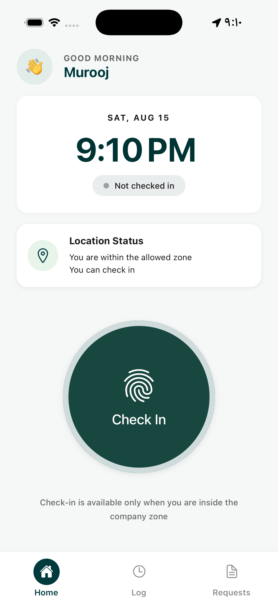
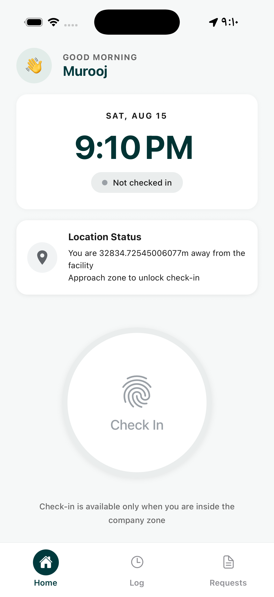
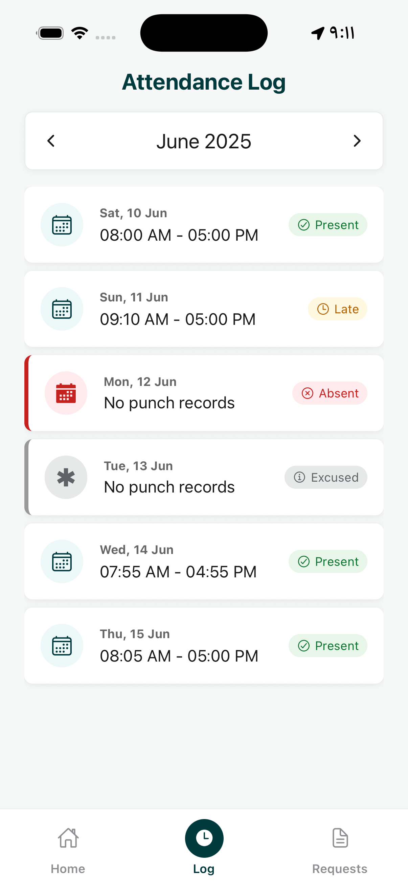
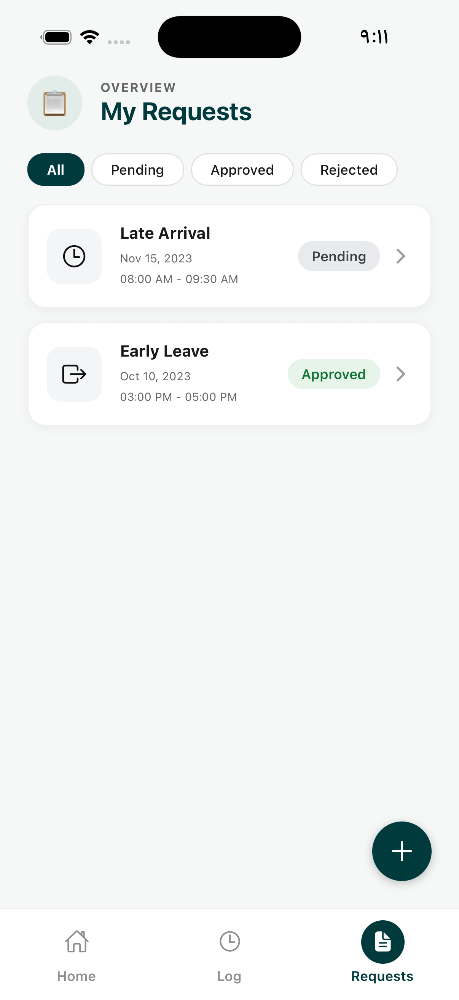
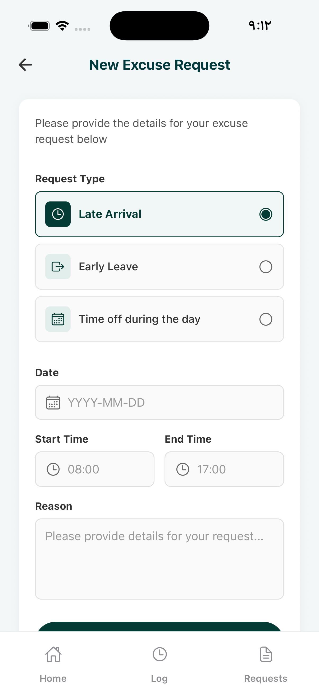

# REA — Employee Attendance & Geofenced Check-In Mobile Application

A premium, modern, and highly interactive React Native Expo mobile application designed for employee attendance tracking and excuse request management. Built using **Expo SDK 57** and **TypeScript**, the application employs **device geofencing (GPS location tracking)** to restrict check-ins and check-outs based on physical proximity to the company headquarters.

---

## 📱 Application Screens Overview

The application features an intuitive, unified navigation flow using **Expo Router (file-based tabs)**:

| Screen                    | Core Functionality                                           | Key UI/UX Elements                                                                                                      |
| :------------------------ | :----------------------------------------------------------- | :---------------------------------------------------------------------------------------------------------------------- |
| **1. Home / Check-In**    | Dynamic geofenced check-in/out portal with real-time status. | Greeting card, digital clock, live status tracker, proximity indicator card, and a stateful primary button.             |
| **2. Attendance Log**     | Historical tracking of employee attendance records.          | Dropdown-style month filter tabs, visual color-coded badges, and detailed check-in/out timestamps.                      |
| **3. My Requests**        | Summary log of submitted excuse requests.                    | Filter chips, collapsible detailed request cards, dynamic empty state, and an interactive Floating Action Button (FAB). |
| **4. New Excuse Request** | Interactive form to request excuses.                         | Radio selectors, input forms, validations, and interactive cancel guards to prevent losing data.                        |

---

## 🛠️ Key Technical Features

### 📍 Proximity-Restricted Check-In (Geofencing)

- **Mock Coords (Facility Location)**:
  ```typescript
  export const FACILITY = {
    latitude: 24.7136,
    longitude: 46.6753,
    allowedRadiusMeters: 200,
  };
  ```
- **Distance Accuracy**: Employs the mathematical **Haversine formula** (`getDistanceInMeters`) to determine the exact distance between the employee's live GPS coordinates and the facility.
- **Proactive State Tracking**: Uses Expo Location's `watchPositionAsync` tracking with `High` accuracy, automatically adjusting the status cards and disabling check-ins when outside the zone (`> 200m`).
- **Settings Recovery**: Listens to app state transitions via React Native's `AppState` API so that if the user grants a permission in the system settings and returns to the app, the location permission instantly updates without needing an app reboot.

### ✨ Implemented Bonus Features

- **🚨 Proximity Threshold Alerts**: Displays a warning card with the exact distance (e.g., _“You are 350m away from the facility”_) and blocks check-in attempts when the user is outside the 200m radius.
- **⏰ Late Arrival Auto-Detection**: Checks the check-in time against the company's official start time (`09:00 AM`). Checking in after this time automatically marks the record as **Late**.
- **📊 Total Worked Hours Calculation**: When checking out, the app calculates and shows the total worked time in a clean format (e.g., `8h 15m`).
- **🛡️ Confirmation Dialog Guards**:
  - Generates a confirmation alert dialog before final check-out.
  - Detects unsaved inputs on the New Excuse Request form and prompts a _"Discard Changes?"_ warning before discarding draft data.
- **🏜️ Styled Empty States**: Custom default placeholders appear on the Attendance Log and Request Filter logs when no matching records exist.

---

## ⚙️ Tech Stack & Dependencies

- **Core Framework**: React Native (via **Expo SDK 57** with **TypeScript**)
- **Routing / Navigation**: `expo-router` (File-based bottom tabs navigation)
- **Location APIs**: `expo-location` (High accuracy background/foreground GPS monitor)
- **Animations & Styling**: StyleSheet API combined with native transitions
- **Icon Set**: `@expo/vector-icons` (Ionicons)

---

## 🚀 How to Run the Project

Follow these steps to set up and run the project locally:

### 1. Prerequisites

Make sure you have Node.js (version 18+ recommended) installed on your system.

### 2. Installation

Clone the repository and install the development dependencies:

```bash
# Clone the repository
git clone https://github.com/muroojib/REA.git
cd REA

# Install dependencies
npm install
```

### 3. Start Expo Server

Run the local dev server:

```bash
npm run start
# OR
npx expo start
```

### 4. Running on Emulator / Device

- **Android Emulator**: Press `a` in the terminal to launch on your active emulator.
- **iOS Simulator**: Press `i` in the terminal to launch on your active Simulator.
- **Physical Device**: Download the **Expo Go** app, then scan the QR code displayed in the terminal.

---

## 🌍 Location Simulation (How to Test Proximity)

To test the geofenced check-in logic (inside vs. outside the 200m zone), you can spoof the GPS location on your emulator:

### iOS Simulator (Xcode)

1. Launch the simulator.
2. In the top menu bar, navigate to **Features** ➔ **Location** ➔ **Custom Location...**
3. Enter the coordinates:
   - **Inside Zone**: Latitude `24.7136`, Longitude `46.6753` (Checks in successfully!).
   - **Outside Zone**: Latitude `24.7100`, Longitude `46.6700` (Disabled with explanatory proximity card).

### Android Emulator (Android Studio)

1. Click the **three dots (... )** on the emulator sidebar to open **Extended Controls**.
2. Select the **Location** tab.
3. Search for the coordinates or enter:
   - **Inside Zone**: Latitude `24.7136`, Longitude `46.6753`
   - **Outside Zone**: Latitude `24.7180`, Longitude `46.6790`
4. Click **Set Location**.

---

## 📸 Screenshots & Media Showcase

| Home (Inside Zone) | Home (Outside Zone) |
| :---: | :---: |
|  |  |

| Attendance Log | Excuse Request List | New Request Form |
| :---: | :---: | :---: |
|  |  |  |

### 🎥 Demo Walkthrough (Screen Recording)


---

## 🤝 Project Structure

```text
src/
├── app/                  # Expo router screens layout (index, attendance, requests)
├── components/           # Generic shared UI assets (EmptyState)
├── constants/            # Global static parameters (FACILITY constants configuration)
├── features/             # Business domain sub-modules
│   ├── attendance/       # Attendance stats cards, logs, mock attendance data
│   ├── location/         # Haversine distance calculator, useLocation monitoring hook
│   └── requests/         # Excuse request models, inputs, form validations
└── theme/                # Typography, global spacing tokens, and color system
```
